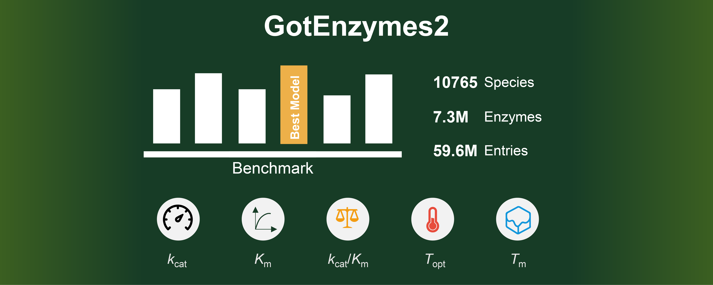

# GotEnzymes2: Prediction of Enzyme Kinetics and Thermal Properties
### **We've got the enzymes you need**




[](https://opensource.org/licenses/MIT)

This is the official repository for the paper **"GotEnzymes2: Expanding Coverage of Enzyme Kinetics and Thermal Properties"**. We provide a comprehensive framework for benchmarking and optimizing prediction models for enzyme properties, along with the code used to generate the [GotEnzymes2 database](https://digitallifethu.com/gotenzymes).

**Online Database:** [https://digitallifethu.com/gotenzymes](https://digitallifethu.com/gotenzymes)

## Core Features

*   **Comprehensive Benchmarking**: We retrained and evaluated multiple state-of-the-art models (UniKP, EITLEM-Kinetics, Seq2Topt, etc.) on unified datasets.
*   **Optimized Models**: Through systematic screening, we identified the best-performing model combinations:
    *   **Kinetics (kcat, Km, kcat/Km)**: `ProtT5` + `MolGen` + `ExtraTrees`
    *   **Thermal Properties (Topt, Tm)**: `ProtT5` + `Seq2Topt`
*   **Large-Scale Database**: The code in this repository can reproduce the [GotEnzymes2](https://digitallifethu.com/gotenzymes) database, which contains:
    *   **10,765** species
    *   **7.3 million** enzymes
    *   **59.6 million** prediction entries
    *   Covering **kcat, Km, kcat/Km, Topt, and Tm**
*   **Open Source & Reproducible**: All code and data links are provided to ensure the reproducibility of our research.

## Installation

```bash
# 1. Clone this repository
git clone https://github.com/LiLabTsinghua/GotEnzymes2.git
cd GotEnzymes2

# 2. Create and activate a conda environment (recommended)
conda create -n gotenzymes2 python=3.12
conda activate gotenzymes2

# 3. Install dependencies
pip install -r requirements.txt
```

You can also use the scripts in this repository to reproduce the model training and benchmarking results from the paper.

## Data and Resources

*   **GotEnzymes2 Database**: [https://digitallifethu.com/gotenzymes](https://digitallifethu.com/gotenzymes)
*   **All Data in this Study**: [https://github.com/LiLabTsinghua/GotEnzymes2](https://github.com/LiLabTsinghua/GotEnzymes2)
*   **Training Datasets Sources**:
    *   [EITLEM-Kinetics](https://github.com/XvesS/EITLEM-Kinetics)
    *   [DeepTM](https://github.com/liimy1/DeepTM)
    *   [TOMER](https://github.com/jafetgado/tomer/)
    *   [Meltome Atlas](https://meltomeatlas.proteomics.wzw.tum.de/master_meltomeatlasapp/)

## How to Cite

If you use our work, please cite the following paper:

> Bingxue Lyu, Ke Wu, Yuanyuan Huang, Mihail Anton, Xiongwen Li, Sandra Viknander, Danish Anwer, Yunfeng Yang, Diannan Lu, Eduard Kerkhoven, Aleksej Zelezniak, Dan Gao, Yu Chen, Feiran Li. (2025). GotEnzymes2: Expanding Coverage of Enzyme Kinetics and Thermal Properties.

## Contact

*   **Feiran Li**: feiranli@sz.tsinghua.edu.cn
*   **Yu Chen**: y.chen3@siat.ac.cn
*   **Dan Gao**: gao.dan@sz.tsinghua.edu.cn
